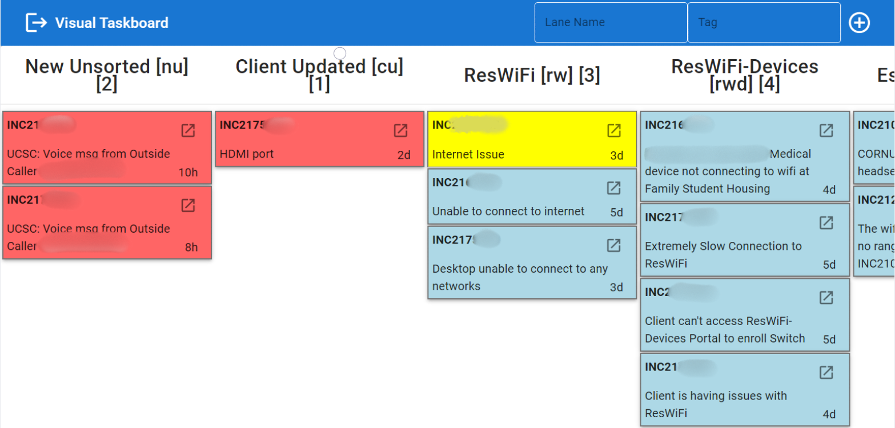
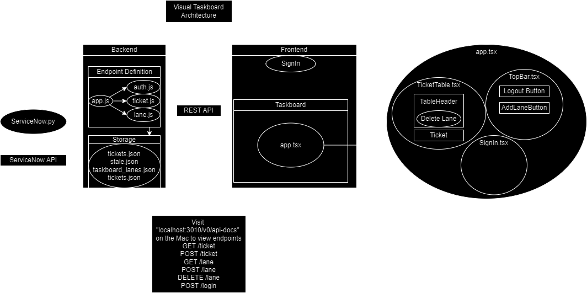

# ResNet Visual Taskboard

(Some information blurred)




# General Use
------------------------

*   Visit [resnet-taskboard.ucsc.edu/](http://resnet-taskboard.ucsc.edu/)
*   Login with the username "ResNet" (case sensitive) and login with the same password you use to login

Note: You must be on a campus network or VPN (ResWiFi, eduroam, etc.) to view the page **Ticket Info** A Ticket shown has a lot of useful information available at a glance.

*   White: The ticket has been worked on, it is not stale & client has not updated it
*   Blue: The ticket is stale and it has been 2 days since we have contacted the client
*   Yellow: The client has updated the ticket
*   Red: Same as the dashboard, the ticket is new & is not assigned yet
*   Days: In the bottom right, the days since the CLIENT has responded, for example a white ticket with the day showing 10 days means we have 1) Contacted the client in the past 2 days (since it's white) 2) The client has NOT sent us a response in 10 days
*   Popout: In the top right, click on the popout icon to open the ticket in a new tab
*   Number: The ticket number
*   Short Description: The tickets short description

**Moving Tickets** 

Using the dashboard should hopefully be self explanatory. To move a ticket,

*   Click on the ticket
*   Click on the lane that you want to move it to from the drop down

NOTE: TICKETS WILL NOT MOVE MANUALLY IF THEY HAVE A TAG 

**Opening Tickets**

*   Click on the Popout icon in the top right and it will open the ticket in servicenow in a new tab

**Tagging Tickets for automatic movement** 

To tag a ticket to a lane, add **!lane\_tag!** anywhere in the description, this tag MUST MATCH the tag of a lane for the ticket to be moved, or else it will be ignored. For example, if I wanted to tag a ticket to the ResWiFi-Devices lane, I would check to see that its tag is "rwd", so I would add **!rwd!** somewhere to the description of the ticket. Due to limitations, the tag MUST BE inside the LONG DESCRIPTION of a ticket, putting it in the Short Description or Tech Notes will NOT WORK 

**Adding Lanes**,

*   Write the lane name and its ticket tag in the two text boxes,
*   Press ENTER or click on the + icon. This will add the lane

**Moving Lanes**

*   Click on a lane and then from the dropdown
*   Click where you want the Lane to move to.

**Deleting Lanes**

*   Click on a lane and scroll down in the menu
*   Select the Trash icon

**Starting the Taskboard** To start the taskboard, go to the Office MAC and on the Desktop, double click the file **RUN\_ME\_TASKBOARD.command** For more info & troubleshooting info/steps, visit the [Github Repository's README](https://github.com/Wyatt-Hawes/ResNet-Visual-Taskboard) or contact Wyatt :)


-----------------------


# If you need to move the server, the static IP is : `128.114.140.150`
### Remember, you must be connected to `ResWiFi` or `eduroam`

# How can I enable/disable ticket tags & automated movement?

### In the `ticket.js` file, search for the variable `enable_abbreviation_movement` and set it to `false`. Save the file and automated ticket movement will be disabled

# So how do I run this thing
# New Way
### Double click `RUN_ME_TASKBOARD.command`. 

### You can close the window that says `Process Complete`. Keep the other two windows open


------

### If for some reason, the script file is deleted, copy `starting_script.command` to the desktop and rename it `RUN_ME_TASKBOARD.command`, open a terminal and navigate to the desktop and type `chmod +x RUN_ME_TASKBOARD.command`


----
# OLD WAY
### After ensuring that the IP address in `backend/api/openapi.yaml` **AND** `frontend/vite.config.js` both match the IP address of the device hosting the servers

1. Open 2 Terminals
2. Navigate to the root folder of the project (The folder that contains the `frontend` & `backend` folders)
3. In one terminal, type `npm run start-frontend`. This will start the website.
4. In the other terminal, type `npm run start-backend`. This will start the backend server.

### Also make sure **BOTH** `.env` fies have been filled out with the same information. (One is in the `root` directory, the other is in `/backend`)

### The `.env` in **BOTH** files **MUST** contain the following information
```
PORT= 3000

# This is the ServiceNow API username & password
# If you dont know what it is, look at the dashboards .env
USER_NAME=
PASSWORD=

# This is the login that you want for the taskboard
# The secret is used to hash the password, it can be any random string of characters
ACCOUNT_NAME=
ACCOUNT_PASSWORD=
SECRET=
```

<br><br>

# Wait I copied the code and I cant run it? Whats happening.

### Well most likely the required packages aren't installed. So lets install them!

1. Open a Terminal
2. Navigate to the root folder of the project (The folder that contains the `frontend` & `backend` folders)
3. type `npm install`
4. type `npm run postinstall`
5. Now go to the above steps and attempt running again. Make sure that the `IP addresses` match to the device!

- Note: This build will NOT work on the Raspberry Pi, if you would like to look into it you may but I believe its an issue with the Vite project builder / Rollup since there is not a version available for the Raspberry Pi. (Wyatt) recommends running it on the MAC with Slack & Spotify since this will always be turned on.

<br><br>

# Im confused, everyone else can access the website but I cant? It's not loading!! :(

### So currently, the server is hosted `locally` this means that the website URL is only available to those on the same network. Make sure you are connected to `ResWiFi` **NOT** ResWifi-devices, eduroam, fshfamily, or ANYTHING ELSE.

### If this doesn't work, go and check what the device hosting the server is connected to, most likely its not ResWiFi, you should probably change it to ResWiFi :) All that matters is that those who want to see the website have to be on the `same network as the hosting device`. This doesn't technically _need_ to be ResWiFi but its the most clear.

<br><br>

# Troubleshooting

### The server is open but the URL doesnt work

- Make sure that the IP in the openAPI.yaml is matching the one on device that is running the server

### The website works but the tickets are outdated / not up to date/ not loading

- This is most likely an issue with the python script, navigate to the folder and run the script
  with `python3 ServiceNow.py` You should then see the errors in the console

### `X` keyword doesnt exist, `Y` isnt a valid command, `Z`, isnt installed.

- Most likely an issue with one of the packages or `python` look up how to install python / the package on that device. The Github Repository is mainly setup to work on Windows with `python3` as the running command. I have put in fixes to make it work on MAC and may not work for other devices.
